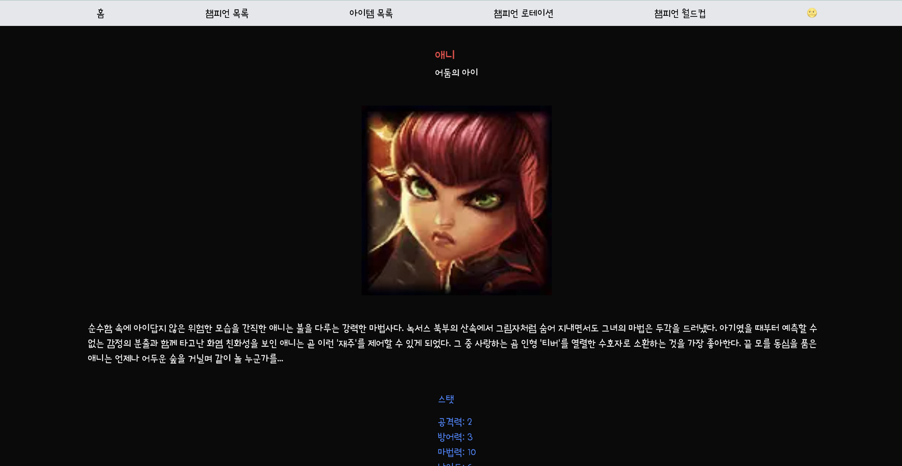

# 리그 오브 레전드 정보 앱

## 프로젝트 개발 기간

2024.09.24 ~ 2024.10.08

## 배포 주소

https://lol-type-scritp-next-js-argument.vercel.app/

## 프로젝트 소개

'리그 오브 레전드(League of Legends, LoL) 정보 앱'은 전 세계적으로 인기 있는 LoL의 다양한 정보를 한 눈에 볼 수 있는 웹 애플리케이션입니다. 이 앱은 Riot Games에서 제공하는 공식 API를 활용하여 사용자들에게 LoL에 대한 다양한 정보를 제공합니다.

## 페이지별 기능

1. **공통 기능**: 네비게이션 바를 통한 페이지 이동 및 다크모드 지원
2. **메인 페이지**: 웹 앱 소개 및 주요 섹션으로의 퀵 링크 제공
3. **챔피언 목록 페이지**: LoL의 전체 챔피언 목록 표시
4. **챔피언 상세 페이지**: 개별 챔피언의 상세 정보 제공
5. **아이템 목록 페이지**: LoL의 전체 아이템 목록 제공
6. **챔피언 로테이션 페이지**: 현재 무료 플레이 가능한 챔피언 목록 표시
7. **챔피언 월드컵 페이지**: 로테이션 챔피언 기반의 토너먼트식 투표 시스템

## 기술 스택

### 핵심 기술

### CSS

### 상태 관리

### 개발 도구

### 배포

### API

## 페이지 스크린 샷

### 메인 페이지

### 챔피언 목록 페이지

### 챔피언 상세 페이지

### 아이템 목록 페이지

### 챔피언 로테이션 페이지

### 챔피언 월드컵 페이지

### 다크모드 해제 시

